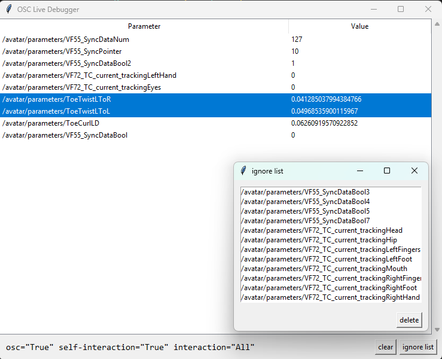

# VRChatOSCDebugger

A tool for monitoring and debugging OSC messages in VRChat.

## Features

- Receive and display OSC messages from VRChat
- User-friendly graphical interface built with Tkinter
- Asynchronous OSC server powered by python-osc

## Screenshot



## Requirements

- Python 3.12+
- [python-osc](https://pypi.org/project/python-osc/)
- Tkinter (usually included with Python)

## Installation

1. Clone the repository:
   ```sh
   git clone https://github.com/yourusername/VRChatOSCDebugger.git
   cd VRChatOSCDebugger
   ```

2. Install dependencies:
   ```sh
   pip install -r requirements.txt
   ```

> **Note:**  
> On Linux, you may need to install the `python3-tk` package for the GUI to work:
> ```sh
> sudo apt-get install python3-tk
> ```

## VRChat Settings

To ensure proper functionality, make sure the following settings are enabled in VRChat (Settings → OSC):

- **Avatar interaction level:** All
- **Avatar self-interaction:** True
- **OSC enabled:** True

## Usage

```sh
python main.py
```


## License & Disclaimer

This software is distributed freely.  
See the [LICENSE](LICENSE) file for details.

**Disclaimer:**  
This tool is provided "as is", without warranty of any kind.  
The author is not responsible for any damage, data loss, or issues caused by using this software. Use at your own risk.

If you need more details or want to add usage examples, let me know!
